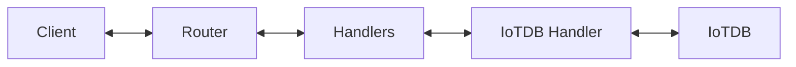

# Information Layer Server (IL)

The Information Layer Server (IL) provides a raw data access API for **read**, **write**, and **subscribe** operations.

Its purpose is to abstract the underlying database technology. It is written in TypeScript.

Clients can interact with it using WebSockets and JSON payloads.

The IL consists of two logical components:

- **Database handler**: interacts with the configured database
- **Router**: API provider that connects to the database handler



Current IoTDB runtime state

- Runtime path uses the Node.js native IoTDB client (@iotdb/client) only.
- Legacy Thrift runtime path has been removed.
- IoTDBHandler owns a shared IoTDBSession.
- SubscriptionSimulator uses the shared session and owns only polling timer lifecycle.
- Subscription is polling-based for the current Node.js client support level.

---

# Information Layer Server - Hello World Setup

## Prerequisites

### Install dependencies:

```sh
npm install
```

> [!NOTE]
> If you encounter environment-specific IoTDB client packaging issues, you may use the historical workaround from project notes. In standard setups, npm install should be sufficient.

Build the TypeScript application natively

Build the application:

```sh
npm run build
```

Run unit tests:

```sh
npm test
```

or:

```sh
npm test --verbose
```

## Run IL with IoTDB: Time-series Data Server

### Start the database

Start IoTDB:

```sh
docker run -d --rm --name iotdb-service -p 6667:6667 -p 9003:9003 apache/iotdb:latest
```

If you plan to run Information Layer with Docker, IoTDB and IL containers should be in the same network:

```sh
docker network create cdsp-net
docker run -d --rm --name iotdb-service --network cdsp-net -p 6667:6667 -p 9003:9003 apache/iotdb:latest
```

Connect to IoTDB CLI (optional):

```sh
docker exec -it iotdb ./start-cli.sh -h 127.0.0.1 -p 6667 -u root -pw root
```

Create a database (recommended):

```sql
CREATE DATABASE root.Vehicle
```

Create desired timeseries (optional):

```sql
CREATE TIMESERIES root.vehicle.Vehicle_TraveledDistance WITH DATATYPE=FLOAT, ENCODING=RLE
CREATE TIMESERIES root.vehicle.Vehicle_Speed WITH DATATYPE=FLOAT, ENCODING=RLE
```

# Start Information Layer Server

Build the Information Layer image:

```sh
docker build -t information-layer .
```

Run IL:

```sh
# Docker

docker run --rm --name information-layer --network cdsp-net -p 8080:8080 -e HANDLER_TYPE=iotdb -e IOTDB_HOST=iotdb-service information-layer

# OR natively

HANDLER_TYPE=iotdb IOTDB_HOST=localhost npm start
```

## IoTDB Node.js client smoke tests

Smoke tests are located in:

- `handlers/src/iotdb/spikes/iotdb-import-smoke.mjs`
- `handlers/src/iotdb/spikes/iotdb-client-smoke.ts`

#### Import smoke

Run:

```bash
node handlers/src/iotdb/spikes/iotdb-import-smoke.mjs
```

Expected:

- `@iotdb/client` imports successfully
- export list includes `Session`

#### Session/query smoke

Run:

```bash
npx ts-node handlers/src/iotdb/spikes/iotdb-client-smoke.ts
```

Expected:

- session opens
- `SHOW DATABASES` executes
- session closes successfully

# Access Information Layer Server API

Connect your WebSocket client to `ws://localhost:8080`.

Examples below use [websocat](https://github.com/vi/websocat) and [jq](https://github.com/jqlang/jq).

## Get

Request patterns:

```json
{
  "jsonrpc": "2.0",
  "method": "get",
  "id": "123-456",
  "params": {
    "instance": "VIN_123",
    "schema": "Vehicle",
    "format": "nested",
    "root": "relative"
  }
}
```

- `format` is optional: `"nested"` or `"flat"` (default: `"nested"`)
- `root` is optional: `"relative"` or `"absolute"` (default: `"relative"`)

With path to a non-leaf node:

```json
{
  "jsonrpc": "2.0",
  "method": "get",
  "id": "123-456",
  "params": {
    "instance": "VIN_123",
    "schema": "Vehicle",
    "path": "CurrentLocation"
  }
}
```

With path to a leaf node:

```json
{
  "jsonrpc": "2.0", // JSON-RPC protocol version
  "method": "get", // read values
  "id": "123-456", // client request ID
  "params": {
    // request parameters
    "instance": "VIN_123", // required instance value
    "schema": "Vehicle", // required schema name
    "path": "CurrentLocation.Latitude" // optional: one concrete leaf signal
  }
}
```

Example:

```sh
echo '{"jsonrpc":"2.0","method":"get","id":"123-456","params":{"instance":"VIN_123","schema":"Vehicle","path":"Speed"}}' | websocat ws://localhost:8080 -n1 | jq
```

## Set

Request patterns:

```json
{
  "jsonrpc": "2.0", // JSON-RPC protocol version
  "method": "set", // write values
  "id": "123-456", // client request ID
  "params": {
    // request parameters
    "instance": "VIN_123", // required; any non-empty text (you can choose it), writes are stored under this instance value
    "schema": "Vehicle", // required schema name
    "path": "CurrentLocation.Latitude", // optional: write this single leaf signal
    "data": 21 // required set payload (leaf scalar)
  }
}
```

Root node with multiple values:

```json
{
  "jsonrpc": "2.0", // JSON-RPC protocol version
  "method": "set", // write values
  "id": "123-456", // client request ID
  "params": {
    // request parameters
    "instance": "VIN_123", // required instance value
    "schema": "Vehicle", // required schema name
    "data": {
      // required set payload (root object)
      "CurrentLocation": {
        // nested object key
        "Latitude": 22, // leaf value
        "Longitude": 46 // leaf value
      }, // end nested object
      "Chassis.SteeringWheel.Angle": 22 // flat-path leaf value
    } // end data
  }
}
```

Non-leaf node with multiple values:

```json
{
  "jsonrpc": "2.0", // JSON-RPC protocol version
  "method": "set", // write values
  "id": "123-456", // client request ID
  "params": {
    // request parameters
    "instance": "VIN_123", // required instance value
    "schema": "Vehicle", // required schema name
    "path": "CurrentLocation", // optional: write this subtree only
    "data": {
      // required set payload (subtree object)
      "Latitude": 22, // leaf value
      "Longitude": 46 // leaf value
    } // end data
  }
}
```

Example:

```sh
echo '{"jsonrpc":"2.0","method":"set","id":"123-456","params":{"instance":"VIN_123","schema":"Vehicle","path":"CurrentLocation.Latitude","data":22}}' | websocat ws://localhost:8080 -n1 | jq
```

Expected response:

```json
{ "jsonrpc": "2.0", "id": "123-456", "result": {} }
```

## Subscribe

Request:

```json
{
  "jsonrpc": "2.0",
  "method": "subscribe",
  "id": "123-456",
  "params": {
    "instance": "VIN_123",
    "schema": "Vehicle"
  }
}
```

- `path` is optional. If omitted, subscribes to schema root.
- `format` is optional: `"nested"` or `"flat"` (default: `"nested"`)
- `root` is optional: `"relative"` or `"absolute"` (default: `"relative"`)

Example:

```sh
echo '{"jsonrpc":"2.0","method":"subscribe","id":"123-456","params":{"instance":"VIN_123","schema":"Vehicle"}}' | websocat ws://localhost:8080 -n | jq
```

On success:

```json
{ "jsonrpc": "2.0", "id": "123-456", "result": {} }
```

## Unsubscribe

```json
{
  "jsonrpc": "2.0",
  "method": "unsubscribe",
  "id": "123-456",
  "params": {
    "instance": "VIN_123",
    "schema": "Vehicle"
  }
}
```

> [!NOTE]
> Unsubscribe matching depends on active subscription parameters. If subscribe was created with a path, the same path must be provided for successful unsubscribe. Also the instance and schema parameters are required to match the subscription, otherwise the unsubscribe request will not be successful.

On success:

```json
{ "jsonrpc": "2.0", "id": "123-456", "result": {} }
```

## Common Pitfalls

- Creating `root.Vehicles` in IoTDB is required before using IL as shown here.
- `schema` + `path` must point to known data points from the configured schema file.
- For `set`, make sure `data` shape matches your `path` scope:
  - leaf path -> scalar value
  - non-leaf/root path -> object with child values
- For `unsubscribe`, send the same instance and scope used in the active `subscribe` request.
