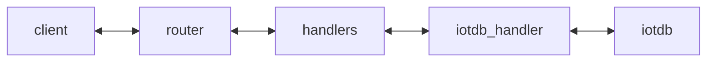

# Information Layer Server (IL)

The Information Layer Server (IL) provides a raw data access API for **read**, **write**, and **subscribe** operations.

Its purpose is to abstract the underlying database technology. It is written in TypeScript.

Clients can interact with it using WebSockets and JSON payloads.

The IL consists of two logical components:

- **Database handler**: interacts with the configured database
- **Router**: API provider that connects to the database handler



## Database and Signal Naming

Use these naming rules to run this repository as documented:

- IoTDB database name in this setup: `root.Vehicles`
- Required request field: `params.schema` (examples use `Vehicle`)
- Optional request field: `params.path` (for example `Speed` or `CurrentLocation.Latitude`)
- Supported data points are loaded from `handlers/config/schema-files/vss_data_points.yaml` (copied to `dist/.../schema-files/` during build)

How IL resolves a requested signal internally:

- `schema` and `path` are merged (for example `Vehicle` + `Speed` -> `Vehicle_Speed`)
- dots in path segments are converted to underscores (for example `CurrentLocation.Latitude` -> `CurrentLocation_Latitude`)

Why `path` exists:

- without `path`, API calls target the schema root (`Vehicle`)
- with `path`, API calls target a subtree or one leaf below that schema root

The examples below follow these rules directly so they work out of the box with this repo.

# Information Layer Server - Hello World Setup

## Prerequisites

Before running `npm install` or building the application, install the IoTDB Node.js client dependency manually.

The Information Layer requires the Apache IoTDB Node.js client to install and build successfully.

During validation, we found packaging inconsistencies in the Node.js client:

- Apache docs/repo reference `@iotdb/client`
- `@iotdb/client` was not directly installable from npm in our environment
- `iotdb-client-nodejs` was installable, but it did not match our setup/export needs

Temporary workaround used in this project:

1. Install the client from the Apache GitHub repository at a known commit
2. Build the package locally in `node_modules/@iotdb/client`

Upstream tracking issue:

- https://github.com/apache/iotdb-client-nodejs/issues/9

Install the dependency from GitHub:

```bash
npm install git+https://github.com/apache/iotdb-client-nodejs.git#2bd256f97077b0c5a86adb0e96cdc7d9097ba432
```

Build the dependency:

```bash
cd node_modules/@iotdb/client
npm install
npm run build
```

> [!WARNING]
> This is a temporary workaround for IoTDB client packaging issues.
> A clean published package flow is preferred long-term.

## Build the TypeScript application natively

Make sure all libraries are installed:

```bash
npm install
```

Build the application:

```bash
npm run build
```

Run the unit tests:

```bash
npx jest
```

or:

```bash
npx jest --verbose
```

## Run IL with IoTDB: Timeseries Data Server

### Start the database

Start IoTDB:

```bash
docker run -d --rm --name iotdb-service -p 6667:6667 -p 9003:9003 apache/iotdb:latest
```

If you plan to run the Information Layer with Docker, the IoTDB and IL containers need to be in the same network:

```bash
docker network create cdsp-net
docker run -d --rm --name iotdb-service --network cdsp-net -p 6667:6667 -p 9003:9003 apache/iotdb:latest
```

Connect to it via CLI to create or view the data (optional):

```bash
docker exec -it iotdb ./start-cli.sh -h 127.0.0.1 -p 6667 -u root -pw root
```

Create a database (recommended):

```bash
create database root.Vehicles
```

Create desired timeseries (optional):

```bash
create timeseries root.Vehicles.Vehicle_TraveledDistance WITH DATATYPE=FLOAT, ENCODING=RLE
create timeseries root.Vehicles.Vehicle_Speed WITH DATATYPE=FLOAT, ENCODING=RLE
```

# Start Information Layer Server

Build the Information Layer image:

```bash
docker build -t information-layer .
```

> [!WARNING] Temporary workaround for IoTDB client packaging issues:
> Actually the Dockerfile has a workaround to build the IoTDB client locally due to packaging issues. If those are resolved, the build steps can be simplified and the workaround removed.

Run IL:

```bash
# Docker
docker run --rm --name information-layer --network cdsp-net -p 8080:8080 -e HANDLER_TYPE=iotdb -e IOTDB_HOST=iotdb-service information-layer

# OR natively
npm install
HANDLER_TYPE=iotdb IOTDB_HOST=localhost npm start
```

## IoTDB Node.js client smoke tests

Smoke tests are located in:

- `handlers/src/iotdb/spikes/iotdb-import-smoke.mjs`
- `handlers/src/iotdb/spikes/iotdb-client-smoke.ts`

#### Import smoke

Run:

```bash
node handlers/src/iotdb/spikes/iotdb-import-smoke.mjs
```

Expected:

- `@iotdb/client` imports successfully
- export list includes `Session`

#### Session/query smoke

Run:

```bash
npx ts-node handlers/src/iotdb/spikes/iotdb-client-smoke.ts
```

Expected:

- session opens
- `SHOW DATABASES` executes
- session closes successfully

# Access Information Layer Server API

Connect your own WebSocket client by connecting to `ws://localhost:8080`.

The examples use [websocat](https://github.com/vi/websocat) and [jq](https://github.com/jqlang/jq)

## Request Field Meaning (applies to GET/SET/SUBSCRIBE/UNSUBSCRIBE)

Field guide:

- `jsonrpc`: protocol version. Must be `"2.0"`.
- `method`: action to execute (`get`, `set`, `subscribe`, `unsubscribe`).
- `id`: your request identifier. IL copies this value into the response so clients can match request/response.
- `params.instance`: target instance key (for example a VIN-like string). Can be any non-empty text; it is not predefined in config.
  - Practical behavior: if nothing was written yet for this instance, `get` returns no values for it.
- `params.schema`: schema root name from the supported schema file (examples use `Vehicle`).
- `params.path`: optional scope under the schema.
  - omitted -> use schema root
  - set (for example `CurrentLocation`) -> use only that subtree or leaf
- `params.data`: value(s) to write, required only for `set`.
- `params.format`: response shape (`nested` or `flat`) for `get` and `subscribe`.
- `params.root`: how paths are shown in `get`/`subscribe` responses.
  - `relative`: paths are shown relative to your requested scope
  - `absolute`: paths are shown from full schema root
  - defaults: `get` -> `relative`, `subscribe` -> `absolute`

Mapping rule used by IL:

- IL combines `schema` + optional `path` to resolve datapoints (example: `Vehicle` + `Speed` -> `Vehicle_Speed`).

## Get

Request patterns:

```json
{
  "jsonrpc": "2.0",
  "method": "get",
  "id": "123-456", # this can be any string or number, it is used to match the response with the request
  "params": {
    "instance": "VIN_123",
    "schema": "Vehicle",
    "format": "nested",
    "root": "relative"
  }
}
```

- `format` is optional and can be `"nested"` or `"flat"`. Default: `"nested"`
- `root` is optional and can be `"relative"` or `"absolute"`. Default: `"relative"`

With path to a non-leaf node to get multiple data points below this node:

```json
{
  "jsonrpc": "2.0",
  "method": "get",
  "id": "123-456",
  "params": {
    "instance": "VIN_123",
    "schema": "Vehicle",
    "path": "CurrentLocation"
  }
}
```

With path to a leaf node to get one data point:

```json
{
  "jsonrpc": "2.0", // JSON-RPC protocol version
  "method": "get", // read values
  "id": "123-456", // client request ID
  "params": {
    // request parameters
    "instance": "VIN_123", // required instance value
    "schema": "Vehicle", // required schema name
    "path": "CurrentLocation.Latitude" // optional: one concrete leaf signal
  }
}
```

Example:

```bash
echo '{"jsonrpc":"2.0","method":"get","id":"123-456","params":{"instance":"VIN_123","schema":"Vehicle","path":"Speed"}}' | websocat ws://localhost:8080 -n1 | jq
```

## Set

Request patterns:

```json
{
  "jsonrpc": "2.0", // JSON-RPC protocol version
  "method": "set", // write values
  "id": "123-456", // client request ID
  "params": {
    // request parameters
    "instance": "VIN_123", // required; any non-empty text (you can choose it), writes are stored under this instance value
    "schema": "Vehicle", // required schema name
    "path": "CurrentLocation.Latitude", // optional: write this single leaf signal
    "data": 21 // required set payload (leaf scalar)
  }
}
```

Root node with multiple values in data, nested and flat (no path provided):

```json
{
  "jsonrpc": "2.0", // JSON-RPC protocol version
  "method": "set", // write values
  "id": "123-456", // client request ID
  "params": {
    // request parameters
    "instance": "VIN_123", // required instance value
    "schema": "Vehicle", // required schema name
    "data": {
      // required set payload (root object)
      "CurrentLocation": {
        // nested object key
        "Latitude": 22, // leaf value
        "Longitude": 46 // leaf value
      }, // end nested object
      "Chassis.SteeringWheel.Angle": 22 // flat-path leaf value
    } // end data
  }
}
```

Non-leaf node with multiple values in data:

```json
{
  "jsonrpc": "2.0", // JSON-RPC protocol version
  "method": "set", // write values
  "id": "123-456", // client request ID
  "params": {
    // request parameters
    "instance": "VIN_123", // required instance value
    "schema": "Vehicle", // required schema name
    "path": "CurrentLocation", // optional: write this subtree only
    "data": {
      // required set payload (subtree object)
      "Latitude": 22, // leaf value
      "Longitude": 46 // leaf value
    } // end data
  }
}
```

Example:

```bash
echo '{"jsonrpc":"2.0","method":"set","id":"123-456","params":{"instance":"VIN_123","schema":"Vehicle","path":"CurrentLocation.Latitude","data":22}}' | websocat ws://localhost:8080 -n1 | jq
```

Expected response:

```json
{ "jsonrpc": "2.0", "id": "123-456", "result": {} }
```

## Subscribe

Request:

```json
{
  "jsonrpc": "2.0",
  "method": "subscribe",
  "id": "123-456",
  "params": {
    "instance": "VIN_123",
    "schema": "Vehicle"
  }
}
```

- `path` is optional. If not provided, it subscribes to the root node of the schema
- `format` is optional and can be `"nested"` or `"flat"`. Default: `"nested"`
- `root` is optional and can be `"relative"` or `"absolute"`. Default: `"relative"`

Example:

```bash
echo '{"jsonrpc":"2.0","method":"subscribe","id":"123-456","params":{"instance":"VIN_123","schema":"Vehicle"}}' | websocat ws://localhost:8080 -n | jq
```

On success:

```json
{ "jsonrpc": "2.0", "id": "123-456", "result": {} }
```

## Unsubscribe

```json
{
  "jsonrpc": "2.0",
  "method": "unsubscribe",
  "id": "123-456",
  "params": {
    "instance": "VIN_123",
    "schema": "Vehicle"
  }
}
```

> [!Note]
> The unsubscribe method matches active subscriptions by websocket client + `instance` + exact resolved datapoint set (derived from `schema` and optional `path`). Use the same subscribe scope to unsubscribe reliably.

On success:

```json
{ "jsonrpc": "2.0", "id": "123-456", "result": {} }
```

## Common Pitfalls

- Creating `root.Vehicles` in IoTDB is required before using IL as shown here.
- `schema` + `path` must point to known data points from the configured schema file.
- For `set`, make sure `data` shape matches your `path` scope:
  - leaf path -> scalar value
  - non-leaf/root path -> object with child values
- For `unsubscribe`, send the same instance and scope used in the active `subscribe` request.
